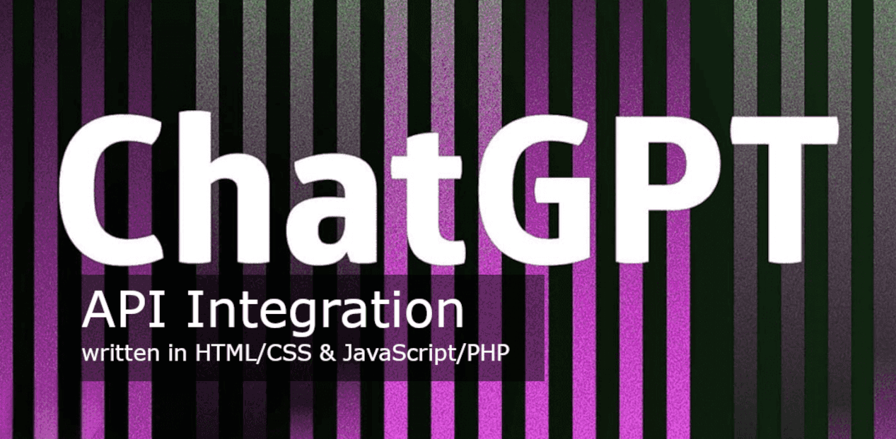

# ChatGPT API Integration (in HTML/CSS with JS/PHP)
###### updated 23.04.2023 (works well)

Integration from GPT 3, 3.5 & 4 for your websites in HTML, CSS, JS & PHP

- [need free 'ChatGPT Comment reply' Plugin for WordPress?](https://github.com/VolkanSah/ChatGPT-Comments-Reply-WordPress-Plugin)
###### ChatGPT is interesting, let's use it to create a better world.

This README.md file guides you through the process of integrating the ChatGPT API into your PHP website, allowing you to set up chat functionality using OpenAI's API.

## Prerequisites
-  PHP 7.4 or higher installed on your web server
-  A web server with support for PHP (e.g., Apache or Nginx)
-  Knowledge of HTML, CSS, and JavaScript (for designing the chat interface)
-  An API key for the ChatGPT API from Openai.com

## API Key
- Register for an account or log in to the OpenAi platform.
- Navigate to the API Keys section and generate a new API key.
- Store the API key safely, as you will need it in the next step.

## Setting Up
- clone this git
- Replace YOUR_API_KEY with the API key you generated earlier in cofig.php.
- Upload the index.html, style.css, script.js, and gptchat.php files to your web server.
- Access the index.html file in your browser (e.g., https://yourdomain.com/index.html).
- Type a message in the chat input field and press Enter or click the Send button to send the message.
- The ChatGPT API should respond with a message from the language model.
- Be careful and set limits on your OpenAI Dashboard
## Screenshot

That's it! You have successfully integrated the ChatGPT API into your PHP website. You can now customize the chat interface and improve the user experience as needed.

**Your support is appreciated, and I would be grateful if you could share this project with others, give it a "star" on GitHub, or become a sponsor.**

## Copyright
S. Volkan Sah Kücükbudak
